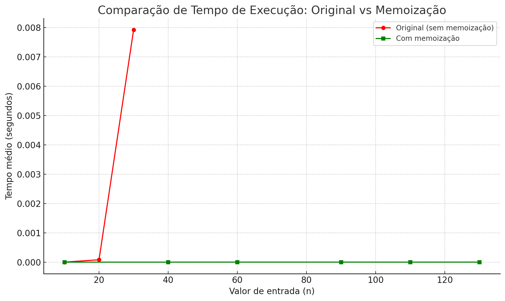
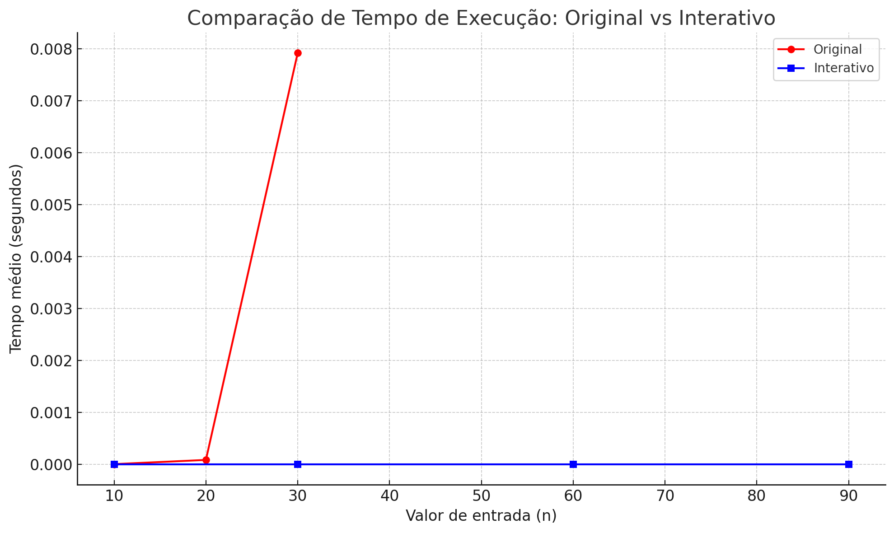
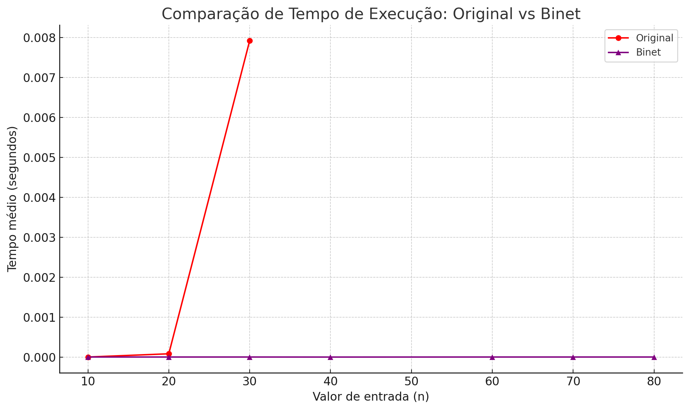

# Análise de Desempenho - Função de Fibonacci

Este documento apresenta uma comparação do tempo médio de execução de diferentes implementações da função de Fibonacci:

- **Original** (recursiva simples)
- **Memo** (com memoização)
- **Interativa** (com laço)
- **Binet** (fórmula fechada)

---

## 🔁 Original vs Memo

### Observações:
- A versão **Original** tem complexidade exponencial e se torna muito lenta para valores altos de `n`.
- A versão **Memo** guarda os valores já calculados, melhorando muito a performance, mesmo com `n` grandes.

### Gráfico:

---

## 🔁 Original vs Interativa

### Observações:
- A versão **Interativa** usa um laço `for`, com complexidade linear `O(n)`.
- O tempo médio de execução se mantém constante e muito baixo, mesmo com valores altos.

### Gráfico:

---

## 🔁 Original vs Binet

### Observações:
- A versão **Binet** usa uma fórmula matemática (fechada) para calcular diretamente o valor de Fibonacci.
- Apesar de envolver ponto flutuante, ela é extremamente rápida e constante, ideal para aplicações em tempo real.

### Gráfico:

---

## ✅ Conclusão Geral

- A implementação **Original** serve bem para fins didáticos, mas é ineficiente.
- As versões **Memo**, **Interativa** e **Binet** oferecem ganhos enormes de desempenho.
- Para aplicações reais, é recomendado o uso da versão **Interativa** ou **Binet**, dependendo da necessidade de precisão.